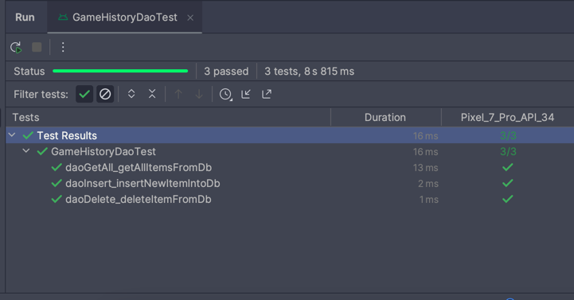

# QuizApp

Project for course mobile application development android TI3@Hogent

## Getting Started

This project makes use of a self
made [Swift Vapor API](https://github.com/JasperLefever/QuizApi-vapor).

## Documentation

Documentation in html can be found in the documentation folder under html.

Documentation in markdown can be found [here](./documentation/markdown/index.md)

## Features

- Swipe to delete
- Refresh on swipe down
- Add category
- Play game
- Offline mode for categories
- History of played games -> saved locally

## Screenshots

### Category overview

#### When no internet connection or server is down

### Add category

### Game

### History

## Tests

### DAO tests

#### GameHistoryDao

#### CategoryDao

### ViewModel tests

#### GameViewModel

### UI tests

#### Navigation

#### AddCategory

### Regular Unit tests

#### NavRoutes

